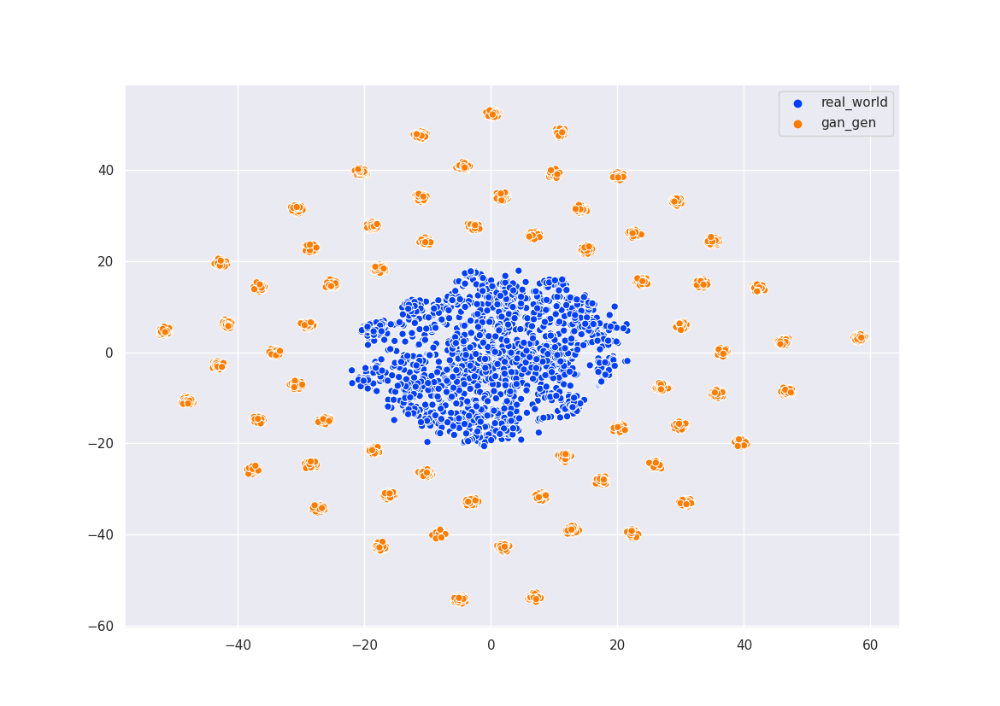
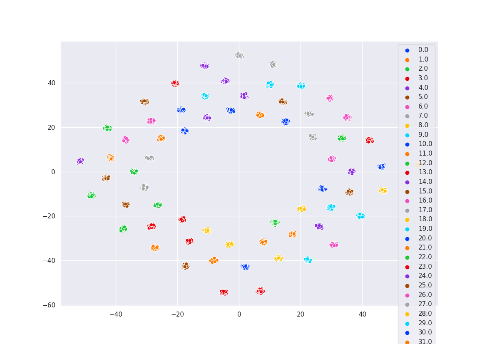
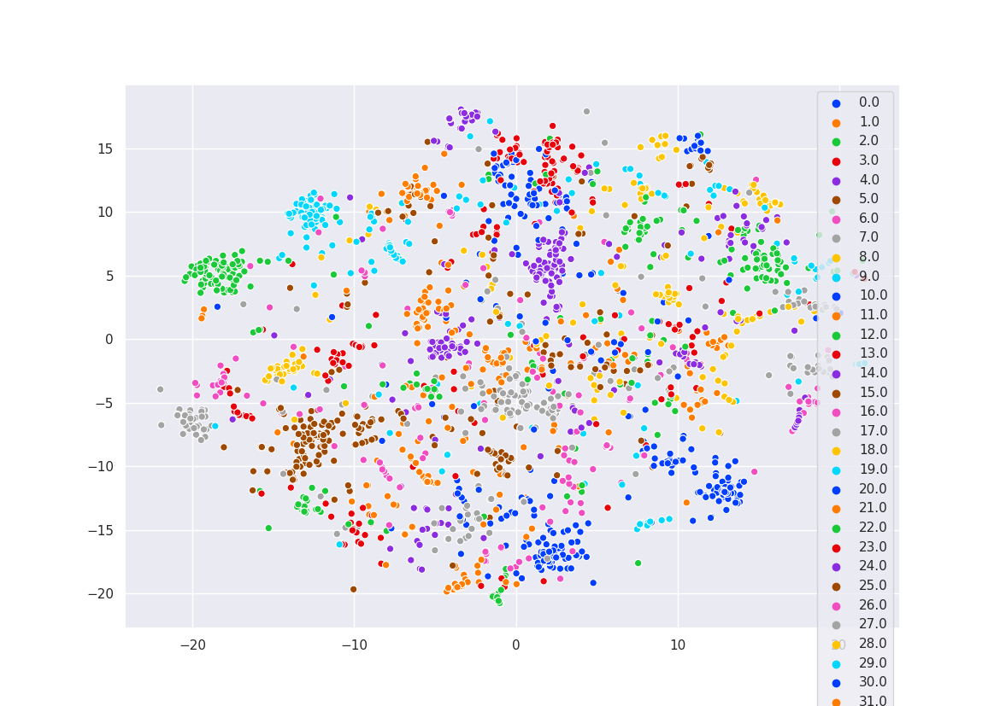
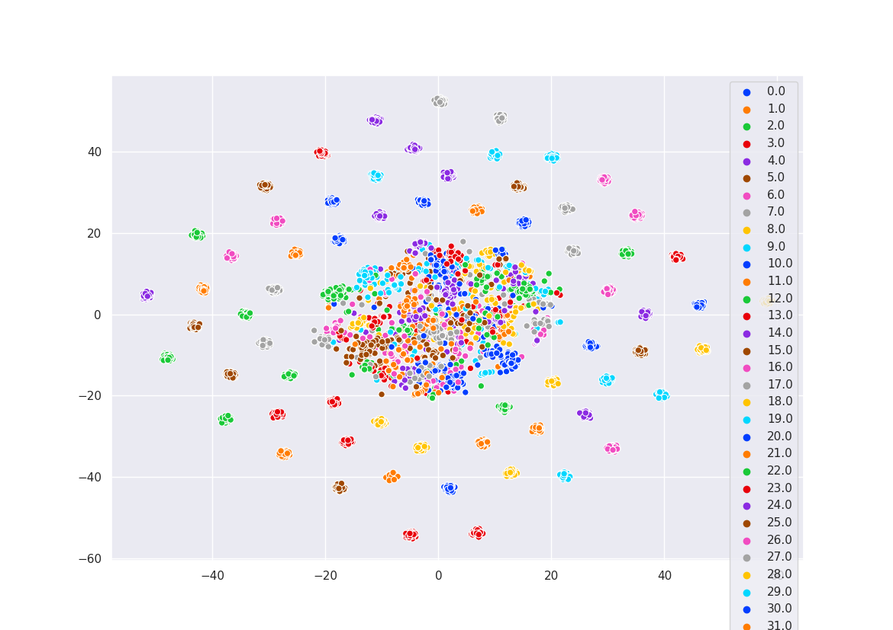
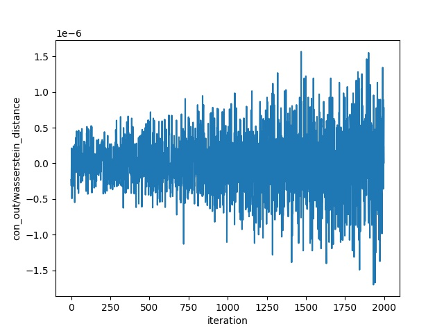
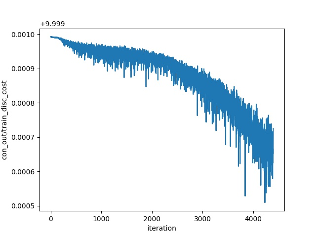
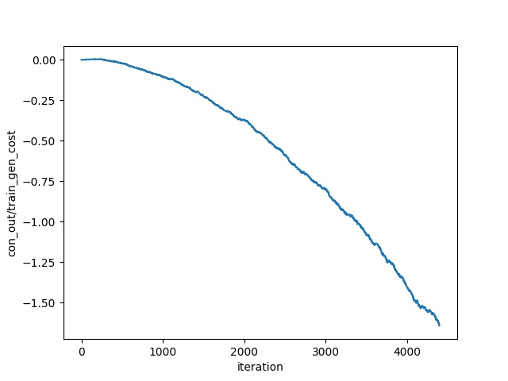

# WGAN-GP for Office-Home Feature Synthesis

A PyTorch conditional WGAN-GP (WGAN with gradient penalty + an ACGAN auxiliary classifier) that generates **2048-dimensional deep feature vectors** for the Office-Home domain-adaptation dataset, conditioned on class label, and visualizes real vs. generated features with t-SNE.

## Overview

Unlike a typical GAN that synthesizes images, this project operates entirely on **pre-extracted feature vectors** (2048-d, e.g. ResNet-50 pool features) stored as CSV files, one per Office-Home domain. A conditional WGAN-GP is trained to generate class-conditioned feature vectors across the 65 Office-Home categories. After training, the generator produces synthetic features for every class, and a t-SNE plot compares the distribution of the generated features against the real ones.

The code is adapted from [`jalola/improved-wgan-pytorch`](https://github.com/jalola/improved-wgan-pytorch) (a PyTorch port of Gulrajani et al.'s "Improved Training of Wasserstein GANs"). The original image-based residual `GoodGenerator`/`GoodDiscriminator` classes are kept in the model files, but the **active code path uses the fully-connected `CSVGenerator`/`CSVDiscriminator`** that map a 128-d noise vector to/from a 2048-d feature vector.

> **Note on the repository name:** the repo is named `wgan` and the file `codes/README.md` is the inherited upstream README describing LSUN **image** generation. That does not reflect this repository's actual code, which synthesizes Office-Home **feature vectors**. Consider renaming the repo to something like `wgan-gp-feature-synthesis` or `office-home-feature-gan` to match what it does.

## Repository layout

All code lives under `codes/`:

| File | Purpose |
| --- | --- |
| `codes/congan_train.py` | Train the **conditional** WGAN-GP (ACGAN auxiliary classifier), 65 classes. Hard-coded config at top; saves to `con_out/`. |
| `codes/train.py` | Train the **unconditional** WGAN-GP on features. CLI via `click`; saves to `out/` (default). |
| `codes/con_gen.py` | Load a trained conditional generator and sample features (50 per class) into `gen_vect_lab.npy`. |
| `codes/plot_tsne.py` | Run t-SNE on real + generated features and save the scatter plot. |
| `codes/load_csv_torch.py` | `load_data_csv()` — reads per-domain CSV feature files into PyTorch `DataLoader`s. |
| `codes/training_utils.py` | Gradient penalty, weight init, noise sampling, `state_dict` helpers. |
| `codes/models/wgan.py` | Unconditional models (`CSVGenerator`, `CSVDiscriminator`, plus image-based `GoodGenerator`/`GoodDiscriminator`). |
| `codes/models/conwgan.py` | Conditional models with the ACGAN auxiliary head. |
| `codes/libs/plot.py` | Loss-curve logging/plotting utilities. |

## Requirements

Pinned in `codes/requirements.txt`:

```
tensorboardX==1.9
tensorflow==2.1.0
torch==1.2.0
torchvision==0.4.0
gpustat==0.6.0
Click==7.0
matplotlib==3.1.1
```

Additional packages imported by the code but not pinned in `requirements.txt`:

- `numpy`, `pandas`, `tqdm`
- `seaborn` and [`MulticoreTSNE`](https://github.com/DmitryUlyanov/Multicore-TSNE) (used only by `plot_tsne.py`)

```bash
pip install -r codes/requirements.txt
pip install numpy pandas tqdm seaborn MulticoreTSNE
```

A CUDA GPU is expected — the training/generation scripts set `os.environ["CUDA_VISIBLE_DEVICES"] = "1"` at the top; edit this to match your machine.

## Data setup

The loaders read four CSV files from a `csv_data/` folder (one row per sample, `2048` feature columns + a trailing integer class label):

```
csv_data/Art_Art.csv
csv_data/Clipart_Clipart.csv
csv_data/Product_Product.csv
csv_data/RealWorld_RealWorld.csv
```

Only `csv_data/RealWorld_RealWorld.csv` is included in this repository; you must supply the remaining domain CSVs (extracted features from the Office-Home dataset) to reproduce full training. The scripts load data with the relative path `../csv_data`, so **run them from inside the `codes/` directory.**

## Usage

Run everything from the `codes/` directory.

**1. Train the conditional (ACGAN) WGAN-GP:**

```bash
cd codes
python congan_train.py
```

Hyperparameters (`NUM_CLASSES=65`, `BATCH_SIZE=65`, `END_ITER=100000`, `CRITIC_ITERS=5`, `LAMBDA=10`, `OUTPUT_PATH='con_out/'`, etc.) are constants at the top of the file — edit them there. The trained `generator.pt` and `discriminator.pt`, loss curves, and sample grids are written to `con_out/`.

Alternatively, train the unconditional model via the `click` CLI:

```bash
cd codes
python train.py --output_path out --batch_size 64 --end_iter 100000 --saving_step 200
```

Note: despite exposing `--train_dir`/`--validation_dir` options (inherited from the upstream image code), `train.py` loads features from the hard-coded `../csv_data` path; those directory options are not used for the CSV pipeline. State dicts are saved to the `--output_path` folder.

**2. Generate class-conditioned feature vectors:**

```bash
cd codes
python con_gen.py
```

Loads `con_out/generator.pt`, samples 50 feature vectors for each of the 65 classes, and saves them (features + labels) to `gen_vect_lab.npy`.

**3. Visualize real vs. generated features with t-SNE:**

```bash
cd codes
python plot_tsne.py
```

Loads `gen_vect_lab.npy` plus a real-feature CSV, runs `MulticoreTSNE`, and saves the scatter plot.

> **Caveats when running:** `plot_tsne.py` has a hard-coded absolute input path (`csv_path = "/home/dipesh/Desktop/wgan/csv_data/RealWorld_Art.csv"`) that must be edited for your setup. Several scripts (`con_gen.py`, `plot_tsne.py`, and parts of `congan_train.py`) contain `pdb.set_trace()` calls that will pause execution at the breakpoint — remove them for unattended runs.

## Results / Figures

The following figures are checked into the repository. The t-SNE plots compare the real Office-Home features against the WGAN-GP-generated features.

Generated features vs. actual features (t-SNE):



Generated features only (t-SNE):



Real-world domain features (t-SNE):



All features (t-SNE):



Conditional training curves (from `con_out/`):

Wasserstein distance | Discriminator cost | Generator cost
:---:|:---:|:---:
 |  | 

## Dataset

[Office-Home](https://www.hemanthdv.org/officeHomeDataset.html) (Venkateswara et al., CVPR 2017) — 65 object categories across 4 domains: **Art, Clipart, Product, and Real-World**. This project consumes pre-extracted 2048-dimensional deep features (as CSV files), not the raw images.

## Citation

This repository is an **unofficial adaptation** and is not itself a published paper. It builds on the following works; please cite the original authors:

WGAN with gradient penalty (the core training algorithm):

```bibtex
@inproceedings{gulrajani2017improved,
  title     = {Improved Training of Wasserstein GANs},
  author    = {Gulrajani, Ishaan and Ahmed, Faruk and Arjovsky, Martin and Dumoulin, Vincent and Courville, Aaron},
  booktitle = {Advances in Neural Information Processing Systems (NeurIPS)},
  year      = {2017}
}
```

Auxiliary Classifier GAN (the conditional / class-conditioned head):

```bibtex
@inproceedings{odena2017conditional,
  title     = {Conditional Image Synthesis with Auxiliary Classifier GANs},
  author    = {Odena, Augustus and Olah, Christopher and Shlens, Jonathon},
  booktitle = {International Conference on Machine Learning (ICML)},
  year      = {2017}
}
```

Office-Home dataset:

```bibtex
@inproceedings{venkateswara2017deep,
  title     = {Deep Hashing Network for Unsupervised Domain Adaptation},
  author    = {Venkateswara, Hemanth and Eusebio, Jose and Chakraborty, Shayok and Panchanathan, Sethuraman},
  booktitle = {IEEE Conference on Computer Vision and Pattern Recognition (CVPR)},
  year      = {2017}
}
```

Base implementation: [jalola/improved-wgan-pytorch](https://github.com/jalola/improved-wgan-pytorch), with acknowledgements to [igul222/improved_wgan_training](https://github.com/igul222/improved_wgan_training) and [caogang/wgan-gp](https://github.com/caogang/wgan-gp).

## License

Released under the [MIT License](LICENSE) (Copyright (c) 2023 Dipesh Tamboli).
